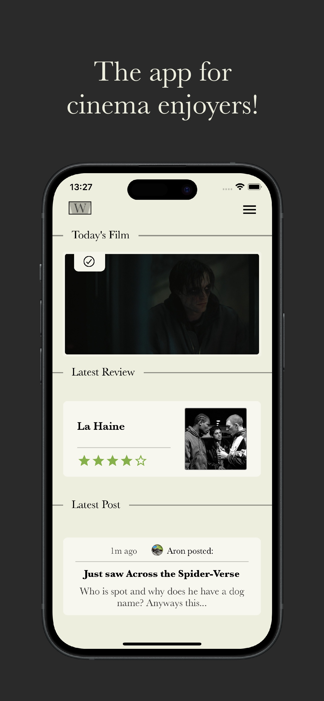

# Widescreen
### About the app

Widescreen is an open-source app for iOS/Android, made for film enthusiasts!

Guess and rate the daily film, read nuanced reviews, discuss film with the community, chat privately with friends, and more!

### Download

- <a href="https://apps.apple.com/nl/app/widescreen/id6450876748?l=en-GB">iOS</a>
- <a href="https://play.google.com/store/apps/details?id=com.bpstudios.Widescreen">Android</a>

### Contribute

How to run for testing/developing:
- Make sure you have the React Native Expo environment set on your device. <a href="https://docs.expo.dev/get-started/installation/">Tutorial</a> by expo.
- run `npx create-expo-app Widescreen`
- Open expo project in preferred text editor.
- Download this GitHub project.
- Drag the files from this project to your expo project. Press 'Copy Folders' if asked. Make sure to overwrite like-named files/folders when asked.
- Open new terminal, run `npm install` to install the used dependencies.
- Run `npm start`, and that's it!

There is other ways to do this, but this explanation is for people who don't have experience with React Native. Do it however you like though.

I have hidden most .php URLs to my database for security reasons. If you need access to the back-end while contributing, contact me via <a href="https://instagram.com/aronvisser_">Instagram</a> or in Widescreen chat (ID: 52079).

Touch up the design, implement new features, fix bugs, anything you can think of. All contributions are welcome, as the code is messy, and probably full of bugs. Be wary, this is my first big React Native project so for very experienced people this code must be horror to look at. 

I'll make sure to the release updates with contributions to this project on the App Store and the Google Play Store within days.

### App preview

  

    
    
    
  

  

    
    
    
  

